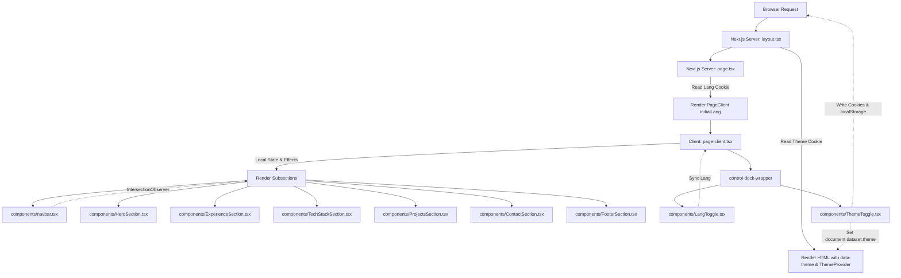

# 📖 Project Context (CONTEXT.md)

This document provides a comprehensive overview of the portfolio codebase, architecture, directories, and configuration. It is designed to give AI agents and developers complete context on how the application works.

---

## 🔍 1. Project Overview & Purpose

This project is a high-performance, single-page personal portfolio website built for **Narawit Soiaudom**. Its primary purpose is to showcase the developer's work experience, education history, technical skills (Tech Stack), projects, and contact channels in a modern, interactive, and fast interface.

### Key Capabilities
*   **Dual Localization:** Complete support for English (EN) and Thai (TH) across all content.
*   **Theme Control:** Sleek system syncing Dark Theme (default) and Light Theme (cream).
*   **Interactive Navigation:** Sticky header that monitors scroll position to underline the active section.
*   **Collapsible Controls Dock:** A floating settings dock at the bottom-right for switching language/theme that can be minimized to reduce screen clutter.
*   **Dynamic Modals:** Project details with dynamic carousels and mock credentials visible in modal popups.

---

## 📐 2. System Architecture

The project runs on **Next.js 16 (App Router)**. To ensure optimal SEO and initial load speeds while retaining full interactivity, it splits layout compilation (Server-Side) and state/interactivity (Client-Side).



---

## 💻 3. Tech Stack

| Layer | Technology | Details / Version |
| :--- | :--- | :--- |
| **Framework** | Next.js | `^16.2.0` (App Router, Turbopack) |
| **Library** | React | `19.2.0` |
| **Language** | TypeScript | `^5` (Strict Typings) |
| **Styling** | Tailwind CSS | `^4.0.0` (Native theme configurations) |
| **Linter / Formatter** | ESLint | `^9` with `eslint-config-next` |
| **Static Hosting** | Cloudinary | Hosts the portfolio background and asset items |

---

## 🗄️ 4. Database Schema

> [!NOTE]
> **This project is a static frontend website and does not utilize a database.** 

All portfolio content is loaded locally from typed static TypeScript files in the `data/` directory. No SQL database, ORM connections, or migration files exist inside this repository. The user data acts as the "Single Source of Truth."

---

## 📂 5. Directory Structure & File Explanations

```
C:\D\cv\portfolio
├── 📂 .github/                 # GitHub workflows configuration
├── 📂 app/                     # Next.js App Router root directory
│   ├── 📄 favicon.ico          # Website favicon asset
│   ├── 📄 globals.css          # Tailwind CSS v4 import, custom design tokens & themes
│   ├── 📄 layout.tsx           # Server Component: Configures RootLayout, Server Theme reader, ThemeProvider
│   ├── 📄 page-client.tsx      # Client Component: State container for language & control panel drawer
│   └── 📄 page.tsx             # Server Component: Root page entry, checks language cookie
├── 📂 components/              # Modular UI Section Components
│   ├── 📄 navbar.tsx           # Sticky Header, smooth-scrolling, section Intersection Observer active tracker
│   ├── 📄 HeroSection.tsx      # Landing layout with background image opacity adjustments
│   ├── 📄 ExperienceSection.tsx# Timelines for Work Experience and Education
│   ├── 📄 TechStackSection.tsx # paginated capabilities categorizer card lists
│   ├── 📄 ProjectsSection.tsx  # Grid of projects, details dialog view overlays
│   ├── 📄 ContactSection.tsx   # Contact form fields & connection links
│   ├── 📄 FooterSection.tsx    # Footer with copy details
│   ├── 📄 LangToggle.tsx       # Switcher component between TH and EN
│   ├── 📄 ThemeToggle.tsx      # Switcher component between Dark and Light mode
│   ├── 📄 Navigation.tsx       # Sub-navigation helpers (Dots, Arrows, Paginations)
│   └── 📄 theme.tsx            # Context provider for managing HTML data-attribute themes
├── 📂 data/                    # Local content datastore modules
│   ├── 📄 contact.ts           # Social links & contact labels
│   ├── 📄 experience.ts        # Typed educational & employment data list
│   ├── 📄 footer.ts            # Copyright labels
│   ├── 📄 hero.ts              # Hero copy & descriptors
│   ├── 📄 navigation.ts        # Top header anchors & titles
│   ├── 📄 projects.ts          # Featured projects metadata (tags, picture URLs, mock credentials)
│   └── 📄 techStack.ts         # Categories of development capabilities
├── 📂 types/                   # TypeScript schemas
│   └── 📄 index.ts             # Global typings: Lang, LocalizedText, Project, TechStack
├── 📄 next.config.ts           # Next.js configuration rules
├── 📄 package.json             # Scripts & dependencies definitions
├── 📄 tsconfig.json            # TypeScript configuration settings
├── 📄 AGENTS.md                # Developer guidelines playbook (merged with copilot instructions)
├── 📄 CONTEXT.md               # System context and architecture details
├── 📄 DESIGN.md                # System design & CSS Token references
└── 📄 DESIGH.md                # Copy of DESIGN.md for fallback purposes
```

---

## 👥 6. Role-Based Features

As a personal portfolio website, there are no admin panels or user login roles. The roles are defined as follows:

### 👤 Public Visitor
All visitors accessing the URL have identical privileges:
1.  **View Portfolio:** Read full information across all sections (Hero, Resume, Tech Stack, Projects, Contact, Footer).
2.  **Toggle Theme:** Switch between Light (cream) and Dark (slate) visual themes instantly.
3.  **Toggle Language:** Switch all page texts between Thai (TH) and English (EN).
4.  **Interactive Navigation:** Use the header buttons to scroll smoothly to sections.
5.  **Examine Projects:** Click on projects to open detailed modals, swipe through carousel screenshots, and view dummy credential guidelines.
6.  **Minimize Dock:** Hide or show the settings dock in the bottom-right corner.

---

## ⚙️ 7. Environment Setup

### Local Port
*   **Port:** Runs on **`http://localhost:3000`** by default when starting dev mode.

### Environment Variables (`.env`)
No external `.env` configuration file is required for the baseline system to operate locally. All resources and content definitions are bundled statically.

---

## ⚠️ 8. Known Gotchas & Warnings

1.  **Hydration Flash Prevention:**
    *   To prevent screen flashing (e.g. starting dark and flashing light) during Next.js SSR, the initial theme and language must be read on the Server.
    *   `app/layout.tsx` checks cookies for `portfolio-theme` and pre-applies `data-theme` on the `<html>` tag before rendering.
    *   `app/page.tsx` checks cookies for `portfolio-lang` to set the initial state.
    *   Any state changes in the client MUST set both `localStorage` (client storage) and `document.cookie` (server transmission) to remain synchronized.
2.  **Next.js Image Warnings:**
    *   The project uses raw `` tags in sections like `TechStackSection.tsx` and `ProjectsSection.tsx`. Next.js linting will show warnings advocating for `next/image` (`@next/next/no-img-element`). If changing this, ensure that remote Cloudinary domains are whitelisted in `next.config.ts`.
3.  **Unused Navbar Prop:**
    *   `Navbar` accepts the `onLangChange` prop to satisfy the `NavbarProps` type contract, but the toggler is placed in the control dock wrapper. To avoid compiler warnings, we simply do not destructure it inside the function signature.
4.  **Observer Margins:**
    *   The sticky header active indicator is governed by `IntersectionObserver` with `-30% 0px -40% 0px` root margins. If adding or resizing page sections dramatically, ensure elements still intersect the viewport margins to trigger navigation active states.
