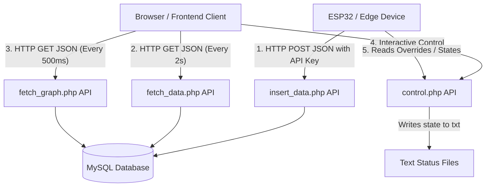

# Developer & Agent System Reference Manual (agent.md)

This reference manual documents the technical system architecture, API endpoints, database structures, and edge device firmware configurations for developers and AI agents maintaining this codebase.

---

## 🧭 System Architecture & Data Flows

The platform is designed around a three-tier model: Edge Hardware Nodes, PHP API Gateway middleware, and JavaScript Clients. The main data flow loops are mapped below:



---

## 🔌 API Endpoints Specifications

### 1. Sensor Data Ingestor ([insert_data.php](file:///c:/D/iot/software_iot/miniproject-iot-smart-home/mini-project-iot/backend/controllers/insert_data.php))
- **Purpose**: Ingests environmental telemetry streams logged by the microcontroller board and saves it to the MySQL database.
- **Security Check**: Inspects incoming HTTP Header `api_key`. Request is rejected if the key does not match `DPI`.
- **Method**: `POST`
- **Content-Type**: `application/json`
- **JSON Input Example**:
  ```json
  {
    "temperature": 29.5,
    "humidity": 55.2,
    "water_level": 12.4,
    "light": 1024,
    "vibration": 150
  }
  ```
- **Response Success (HTTP 200)**:
  ```json
  {"status": "success", "message": "Insert success"}
  ```
- **Response Forbidden (HTTP 403)**:
  ```json
  {"status": "error", "message": "Invalid API key"}
  ```

### 2. Live Telemetry Fetcher ([fetch_data.php](file:///c:/D/iot/software_iot/miniproject-iot-smart-home/mini-project-iot/backend/controllers/fetch_data.php))
- **Purpose**: Returns the most recent record of sensor logs formatted as floating-point JSON parameters. Used by UI card panels.
- **Method**: `GET`
- **JSON Output Example**:
  ```json
  [
    {
      "water_level": 12.4,
      "temperature": 29.5,
      "humidity": 55.2,
      "light": 1024,
      "vibration": 150,
      "created_at": "2026-06-04 15:30:00"
    }
  ]
  ```

### 3. Historical Telemetry Fetcher ([fetch_graph.php](file:///c:/D/iot/software_iot/miniproject-iot-smart-home/mini-project-iot/backend/controllers/fetch_graph.php))
- **Purpose**: Fetches the 20 most recent rows from the database sorted by `created_at` timestamp. Feeds the historical Chart.js display.
- **Method**: `GET`
- **JSON Output**: An array of sensor logs database entries.

### 4. Interactive Actuator Controller ([control.php](file:///c:/D/iot/software_iot/miniproject-iot-smart-home/mini-project-iot/backend/controllers/control.php))
- **Purpose**: Gets or sets interactive overrides for the LED and Servo (Dam Gate) states on disk.
- **Method**: `GET`
- **Query Parameters**:
  - `?led=on` or `?led=off` (Updates `led_status.txt`)
  - `?servo=50` (Gate Open) or `?servo=0` (Gate Close) (Updates `servo_angle.txt`)
- **State Reading (Default GET without params)**:
  - Parses status files on disk. Falls back to `led=off` and `servo=0` if files do not exist.
  - JSON Output Example: `{"led": "on", "servo": "50"}`

### 5. Control Mode Selector ([control_mode.php](file:///c:/D/iot/software_iot/miniproject-iot-smart-home/mini-project-iot/backend/controllers/control_mode.php))
- **Purpose**: Sets or retrieves the system-wide automation mode state.
- **Method**: `GET`
- **Query Parameters**: `?mode=manual` or `?mode=sensor` (Updates `mode_status.txt`)
- **Mode Reading (Default GET)**: Returns the current mode state, e.g., `{"mode": "manual"}`.

---

## 💾 Database Schema

The core tables in the `iot_project_db` MySQL database are defined below:

```text
Table: sensor_data
+-------------+-----------+------+-----+-------------------+-------------------+
| Field       | Type      | Null | Key | Default           | Extra             |
+-------------+-----------+------+-----+-------------------+-------------------+
| id          | int(11)   | NO   | PRI | NULL              | auto_increment    |
| temperature | float     | YES  |     | NULL              |                   |
| humidity    | float     | YES  |     | NULL              |                   |
| water_level | float     | YES  |     | NULL              |                   |
| light       | float     | YES  |     | NULL              |                   |
| vibration   | float     | YES  |     | NULL              |                   |
| created_at  | timestamp | NO   |     | CURRENT_TIMESTAMP |                   |
+-------------+-----------+------+-----+-------------------+-------------------+

Table: admindpi
+------------+-------------+------+-----+-------------------+-------------------+
| Field      | Type        | Null | Key | Default           | Extra             |
+------------+-------------+------+-----+-------------------+-------------------+
| id         | int(11)     | NO   | PRI | NULL              | auto_increment    |
| username   | varchar(50) | NO   | UNI | NULL              |                   |
| password   | varchar(255)| NO   |     | NULL              |                   |
| created_at | timestamp   | NO   |     | CURRENT_TIMESTAMP |                   |
+------------+-------------+------+-----+-------------------+-------------------+
```

---

## 🤖 Edge Firmware & Control Logics

### 1. Core Controller Firmware ([iot.ino](file:///c:/D/iot/software_iot/miniproject-iot-smart-home/mini-project-iot/data/iot.ino))
Runs loop diagnostics every 2 seconds (`delay(2000)`), conducting the following tasks:
- **Ambient Lighting System (LDR & LED)**:
  - Threshold: LDR analog intensity of **1000** (Analog bounds: 0 - 4095).
  - Logic: If LDR value falls below 1000 (Dark environment) -> `LED` (Pin 2) turns `HIGH`. If above 1000 -> `LED` turns `LOW`.
- **Seismic Alert System (Vibration Sensor & Buzzer)**:
  - Threshold: Vibration sensor value of **2500** (Analog bounds: 0 - 4095).
  - Logic: If sensor value exceeds 2500 -> Beeps the active `BUZZER` (Pin 16) at a 3.5kHz frequency. The pattern repeats 10 times in brief 50ms pulse durations separated by a 100ms delay.
- **Automatic Dam Gate Controller (Ultrasonic & SG90 Servo)**:
  - Distance formula: `(duration * 0.0343) / 2`
  - Logic:
    - If `waterLevel > 20.0 cm` and the gate is closed -> Sweeps `Servo` (Pin 4) to 180° (Opens Gate) and marks state as open.
    - If `waterLevel < 10.0 cm` and the gate is open -> Returns `Servo` to 0° (Closes Gate) and marks state as closed.

### 2. Clock & Auxiliary Lighting Controller ([micro.ino](file:///c:/D/iot/software_iot/miniproject-iot-smart-home/mini-project-iot/data/micro.ino))
Polls and outputs local time statistics on a LiquidCrystal I2C 20x4 display every 1 second:
- **RTC Display**: Retrieves precise dates and times (HH:MM:SS) from the DS1307 real-time clock.
- **Smart Lighting Override**:
  - Maps analog photocell inputs on Pin A0 to a percentage (0-100%).
  - Logic: Active between 09:00 AM and 23:59 PM. If mapped light drops below `lightThreshold` (65%), it turns `HIGH` the LED connected to Pin 6.

---

## 🔍 Development Guidelines for AI Agents & Developers
- **Endpoints Domain**: The variable values for `serverUrl` and `serverMode` inside [control.js](file:///c:/D/iot/software_iot/miniproject-iot-smart-home/mini-project-iot/frontend/js/control.js) contain hardcoded IP `172.25.11.10`. Make sure to update this destination to match your target host.
- **Noisy Readings**: The raw water level measurements from the ultrasonic sensor may fluctuate due to water turbulence. Consider implementing a moving average filter within the firmware to smooth out values.
- **State Race Conditions**: When the dashboard is set to Manual Mode, clicking buttons updates the text state files, but the [iot.ino](file:///c:/D/iot/software_iot/miniproject-iot-smart-home/mini-project-iot/data/iot.ino) script is configured to prioritize sensor measurements. Be mindful of this behaviour when attempting manual overrides on hardware.
