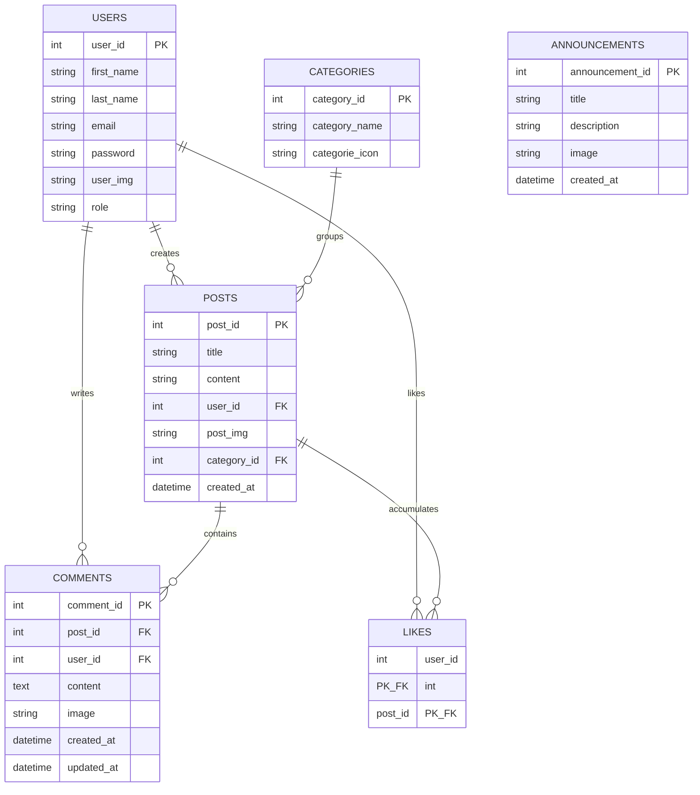

# Project Context (`CONTEXT.md`)

This document describes the business domain, user roles, relational database schema, and technical logic flow for the DPI Thread Forum.

> [!IMPORTANT]
> ### 🚨 Context Update Rule
> If you implement any significant architectural modifications, database schema edits, API changes, or new backend logic flows, you **MUST** update [CONTEXT.md](file:///c:/D/thread/miniproject-Thread/CONTEXT.md) to ensure it accurately reflects the latest technical specifications.
> 
> **Workflow Step:** Always refer to [AGENT.md](file:///c:/D/thread/miniproject-Thread/AGENT.md) as the root developer guide and coordinator for all tasks.

---

## 🐳 Runtime Environment

This project runs entirely inside **Docker** containers. There is no XAMPP/Laragon dependency.

| Service     | Container Name   | Notes                                              |
| ----------- | ---------------- | -------------------------------------------------- |
| Nginx       | `dpi_nginx`      | Serves app on port `8080`, proxies PHP via FastCGI |
| PHP 8.2-FPM | `dpi_php`        | Executes all `.php` files                          |
| MySQL 8.0   | `dpi_mysql`      | DB host name is `mysql` (not `localhost`)          |
| phpMyAdmin  | `dpi_phpmyadmin` | Accessible at port `8081`                          |

**DB credentials** are loaded from environment variables defined in `.env` (never hardcoded).
The `config/server.php` uses `getenv()` to read `DB_HOST`, `DB_NAME`, `DB_USER`, `DB_PASS`.

---

## 👥 User Roles & Permissions

The platform supports two roles with distinct privileges:

### 1. General User

- **Capabilities:**
  - Register a new account and log in.
  - Browse all active threads or filter posts by category using Swiper slide components.
  - Search posts by keyword (title/content).
  - Create a new discussion thread with an optional image upload.
  - Edit or delete their own posts.
  - Like or unlike threads posted by other users.
  - Comment on posts with optional image attachments.
  - Edit or delete their own comments.
  - Modify their profile details (first name, last name, email, avatar image, and password).

### 2. Administrator

- **Capabilities:**
  - Inherits all general user capabilities.
  - Access user management console to update user details, toggle roles, or delete users.
  - Manage categories (create new categories, delete inactive categories, update icons).
  - Publish and manage announcements stored in the database (displayed on the sidebar announcements widget).

---

## 🗄️ Database Schema & Entities

The platform uses a relational MySQL database named **`dpi_db`** containing the following entities:

### Table Specifications

#### 1. `users`

- `user_id` (INT, PK, Auto Increment)
- `first_name` (VARCHAR)
- `last_name` (VARCHAR)
- `email` (VARCHAR, Unique): Login credential.
- `password` (VARCHAR): Hashed using PHP's `password_hash()`.
- `user_img` (VARCHAR): Profile picture filename (stored in `uploads/`).
- `role` (VARCHAR): Roles like `user` or `admin`.

#### 2. `categories`

- `category_id` (INT, PK, Auto Increment)
- `category_name` (VARCHAR): Name of the category.
- `categorie_icon` (VARCHAR): Category icon filename/filepath.

#### 3. `posts`

- `post_id` (INT, PK, Auto Increment)
- `title` (VARCHAR): Post title.
- `content` (TEXT): Post content.
- `user_id` (INT, FK -> `users.user_id`): Post author.
- `post_img` (VARCHAR): Optional post image filename.
- `category_id` (INT, FK -> `categories.category_id`): Linked category.
- `created_at` (TIMESTAMP): Date and time of creation.

#### 4. `comments`

- `comment_id` (INT, PK, Auto Increment)
- `post_id` (INT, FK -> `posts.post_id`)
- `user_id` (INT, FK -> `users.user_id`): Comment author.
- `content` (TEXT): Text content of the comment.
- `image` (VARCHAR): Optional comment image filename.
- `created_at` (TIMESTAMP)
- `updated_at` (TIMESTAMP)

#### 5. `likes`

- Many-to-many relationship mapping table to enforce unique likes per user per post.
- `user_id` (INT, FK -> `users.user_id`)
- `post_id` (INT, FK -> `posts.post_id`)

#### 6. `announcements`

- `announcement_id` (INT, PK, Auto Increment)
- `title` (VARCHAR): Title of the announcement.
- `description` (TEXT): Description of the announcement.
- `image` (VARCHAR): Announcement image filename/filepath.
- `created_at` (TIMESTAMP): Date and time of creation.

---

## ⚡ Technical Logic Specifications

1. **Admin Announcements widget:**
   Admin system announcements are stored inside the `announcements` database table. The backend fetches them via PDO queries in `layouts/con4.php` and renders cards inside the sidebar template.

2. **AJAX Likes:**
   Pressing the Like button triggers a POST request to `index.php?page=toggle_like`. The backend toggles the user's like entry in the database and returns a JSON payload containing the updated like count and the toggle action (`like` or `unlike`).

3. **Swiper Integration:**
   `layouts/category_slide.php` implements the Swiper.js layout for slide elements, which are styled using Vanilla CSS in `styles/category_slidestyle.css` and controlled using `assets/js/script.js`.

4. **Database Initialization:**
   The `db.sql` file at the project root is automatically imported by MySQL container on first run via Docker's `docker-entrypoint-initdb.d/` mechanism. No manual import step is needed.

5. **Environment Variables:**
   All sensitive configuration (DB credentials) is stored in `.env` and injected into containers by Docker Compose. PHP reads them via `getenv()` in `config/server.php`.
