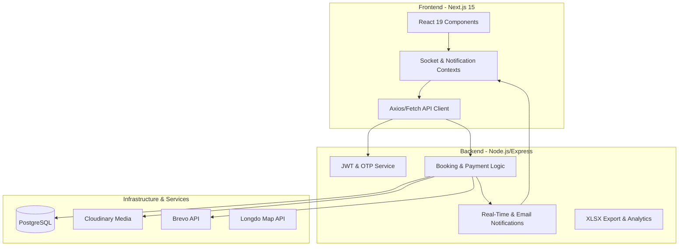

# Sport Hub — AI Agent Onboarding & System Guide

Welcome to the Sport Hub project codebase. This document serves as the central, comprehensive guide for AI coding agents to understand the project architecture, database design, API design patterns, and development guidelines.

---

## Before Starting Any Task

- Always read CONTEXT.md before writing any code
- Clarify requirements before coding if anything is unclear
- Never install new libraries without asking first

---

## 1. Project Overview & Personas

Sport Hub is a premium, full-stack sports venue booking platform designed with three core roles:

1. **Customers:** Browse, search, follow, review venues, and book sports slots (paying via PromptPay QR).
2. **Field Owners:** Register venues, manage sub-fields, facilities, and bookings, and view business analytics/reports.
3. **Administrators:** Oversee users, approve/reject field registrations, and maintain global sport categories.

---

## 2. System Architecture



---

## 3. Database Schema

The database runs on PostgreSQL. When creating or modifying query logic, refer to these precise table structures:

### 3.1. User & Authentication

- **`users`**: Main account credentials and state.
  ```sql
  CREATE TABLE users (
    user_id       SERIAL PRIMARY KEY,
    user_name     VARCHAR(100) UNIQUE NOT NULL,
    first_name    VARCHAR(100) NOT NULL,
    last_name     VARCHAR(100) NOT NULL,
    email         VARCHAR(255) UNIQUE NOT NULL,
    password      TEXT NOT NULL,
    role          VARCHAR(20) NOT NULL DEFAULT 'customer' CHECK (role IN ('customer', 'field_owner', 'admin')),
    status        VARCHAR(50) DEFAULT 'รอยืนยัน', -- "รอยืนยัน", "ตรวจสอบแล้ว", "ไม่ผ่านการตรวจสอบ"
    verification  VARCHAR(20),
    otp_expiry    TIMESTAMPTZ,
    user_profile  TEXT, -- Cloudinary image URL
    created_at    TIMESTAMPTZ DEFAULT NOW()
  );
  ```
- **`password_reset`**: Temporary tokens for user password recovery.
  ```sql
  CREATE TABLE password_reset (
    id          SERIAL PRIMARY KEY,
    user_id     INTEGER NOT NULL REFERENCES users(user_id) ON DELETE CASCADE,
    token       VARCHAR(20) NOT NULL,
    expires_at  TIMESTAMPTZ NOT NULL
  );
  ```

### 3.2. Venues & Sub-fields

- **`field`**: Sports venues owned by field owners.
  ```sql
  CREATE TABLE field (
    field_id          SERIAL PRIMARY KEY,
    user_id           INTEGER NOT NULL REFERENCES users(user_id) ON DELETE CASCADE,
    field_name        VARCHAR(200) NOT NULL,
    address           TEXT,
    gps_location      TEXT, -- Format: "lat,lng" or similar JSON/string
    open_hours        VARCHAR(10),
    close_hours       VARCHAR(10),
    number_bank       VARCHAR(50),
    account_holder    VARCHAR(200),
    price_deposit     NUMERIC(10,2) DEFAULT 0,
    name_bank         VARCHAR(100),
    documents         TEXT, -- Cloudinary link or path
    img_field         TEXT, -- Main image URL
    status            VARCHAR(50) DEFAULT 'รอตรวจสอบ', -- "รอตรวจสอบ", "ผ่านการอนุมัติ", "ไม่ผ่านการอนุมัติ"
    reasoning         TEXT, -- Rejection explanation
    open_days         TEXT[], -- Array of weekdays open, e.g. {'Monday', 'Tuesday'}
    field_description TEXT,
    cancel_hours      INTEGER DEFAULT 0,
    slot_duration     VARCHAR(20) -- e.g. "1 hour", "30 mins"
  );
  ```
- **`sub_field`**: Specific playable fields/courts inside a venue.
  ```sql
  CREATE TABLE sub_field (
    sub_field_id     SERIAL PRIMARY KEY,
    field_id         INTEGER NOT NULL REFERENCES field(field_id) ON DELETE CASCADE,
    sub_field_name   VARCHAR(200) NOT NULL,
    price            NUMERIC(10,2) DEFAULT 0,
    sport_id         INTEGER REFERENCES sports_types(sport_id) ON DELETE SET NULL,
    user_id          INTEGER REFERENCES users(user_id) ON DELETE SET NULL,
    wid_field        NUMERIC(10,2) DEFAULT 0,
    length_field     NUMERIC(10,2) DEFAULT 0,
    players_per_team INTEGER DEFAULT 0,
    field_surface    VARCHAR(100) DEFAULT ''
  );
  ```
- **`sports_types`**: Supported sport categories (e.g. Football, Badminton).
  ```sql
  CREATE TABLE sports_types (
    sport_id    SERIAL PRIMARY KEY,
    sport_name  VARCHAR(100) UNIQUE NOT NULL
  );
  ```

### 3.3. Facilities & Extras

- **`facilities`**: Master database list of selectable amenities.
  ```sql
  CREATE TABLE facilities (
    fac_id    SERIAL PRIMARY KEY,
    fac_name  VARCHAR(200) UNIQUE NOT NULL
  );
  ```
- **`field_facilities`**: Active amenities and equipment rentals at a specific venue.
  ```sql
  CREATE TABLE field_facilities (
    field_fac_id    SERIAL PRIMARY KEY,
    field_id        INTEGER NOT NULL REFERENCES field(field_id) ON DELETE CASCADE,
    fac_name        VARCHAR(200) NOT NULL,
    fac_price       NUMERIC(10,2) DEFAULT 0,
    quantity_total  INTEGER DEFAULT 1,
    description     VARCHAR(300),
    image_path      TEXT
  );
  ```
- **`add_on`**: Sub-field level optional add-ons.
  ```sql
  CREATE TABLE add_on (
    add_on_id     SERIAL PRIMARY KEY,
    sub_field_id  INTEGER NOT NULL REFERENCES sub_field(sub_field_id) ON DELETE CASCADE,
    content       TEXT,
    price         NUMERIC(10,2) DEFAULT 0
  );
  ```

### 3.4. Bookings & Payments

- **`bookings`**: Core reservation records.
  ```sql
  CREATE TABLE bookings (
    booking_id      SERIAL PRIMARY KEY,
    field_id        INTEGER NOT NULL REFERENCES field(field_id) ON DELETE CASCADE,
    user_id         INTEGER NOT NULL REFERENCES users(user_id) ON DELETE CASCADE,
    sub_field_id    INTEGER NOT NULL REFERENCES sub_field(sub_field_id) ON DELETE CASCADE,
    booking_date    DATE NOT NULL,
    start_time      TIME NOT NULL,
    end_time        TIME NOT NULL,
    total_hours     NUMERIC(5,2),
    total_price     NUMERIC(10,2),
    pay_method      VARCHAR(50),
    total_remaining NUMERIC(10,2) DEFAULT 0,
    activity        VARCHAR(200),
    status          VARCHAR(20) DEFAULT 'pending' CHECK (status IN ('pending', 'approved', 'rejected', 'complete', 'verified', 'cancelled')),
    reasoning       TEXT,
    cancel_time     TIMESTAMPTZ,
    deposit_slip    TEXT, -- URL to receipt/slip image
    total_slip      TEXT, -- URL to receipt/slip image
    start_date      DATE, -- Recurrence/multi-date start
    end_date        DATE, -- Recurrence/multi-date end
    selected_slots  TEXT[], -- Array of strings for reserved hourly ranges
    updated_at      TIMESTAMPTZ DEFAULT NOW(),
    created_at      TIMESTAMPTZ DEFAULT NOW()
  );
  ```
- **`booking_fac`**: Selected amenities for a specific booking.
  ```sql
  CREATE TABLE booking_fac (
    booking_fac_id  SERIAL PRIMARY KEY,
    booking_id      INTEGER NOT NULL REFERENCES bookings(booking_id) ON DELETE CASCADE,
    field_fac_id    INTEGER REFERENCES field_facilities(field_fac_id) ON DELETE SET NULL,
    fac_name        VARCHAR(200),
    quantity        INTEGER DEFAULT 1
  );
  ```
- **`payment`**: Associated receipt slips uploaded for validation.
  ```sql
  CREATE TABLE payment (
    payment_id    SERIAL PRIMARY KEY,
    booking_id    INTEGER NOT NULL REFERENCES bookings(booking_id) ON DELETE CASCADE,
    deposit_slip  TEXT,
    total_slip    TEXT,
    created_at    TIMESTAMPTZ DEFAULT NOW()
  );
  ```

### 3.5. Social & Communications

- **`reviews`**: Ratings and comments left by customers.
  ```sql
  CREATE TABLE reviews (
    reviews_id  SERIAL PRIMARY KEY,
    user_id     INTEGER NOT NULL REFERENCES users(user_id) ON DELETE CASCADE,
    field_id    INTEGER NOT NULL REFERENCES field(field_id) ON DELETE CASCADE,
    booking_id  INTEGER REFERENCES bookings(booking_id) ON DELETE SET NULL,
    rating      NUMERIC(2,1) NOT NULL CHECK (rating >= 1 AND rating <= 5),
    comment     TEXT,
    created_at  TIMESTAMPTZ DEFAULT NOW()
  );
  ```
- **`posts`**: News and announcements published by field owners.
  ```sql
  CREATE TABLE posts (
    post_id     SERIAL PRIMARY KEY,
    title       VARCHAR(500) NOT NULL,
    content     TEXT, -- TinyMCE Rich-text content
    field_id    INTEGER NOT NULL REFERENCES field(field_id) ON DELETE CASCADE,
    created_at  TIMESTAMPTZ DEFAULT NOW()
  );
  ```
- **`post_images`**: Images attached to venue posts.
  ```sql
  CREATE TABLE post_images (
    image_id    SERIAL PRIMARY KEY,
    post_id     INTEGER NOT NULL REFERENCES posts(post_id) ON DELETE CASCADE,
    image_url   TEXT NOT NULL
  );
  ```
- **`notifications`**: Live updates for users (booking updates, venue approvals).
  ```sql
  CREATE TABLE notifications (
    notify_id   SERIAL PRIMARY KEY,
    sender_id   INTEGER REFERENCES users(user_id) ON DELETE SET NULL,
    recive_id   INTEGER REFERENCES users(user_id) ON DELETE CASCADE,
    topic       VARCHAR(100) NOT NULL,
    messages    TEXT,
    key_id      INTEGER, -- Context ID (e.g. booking_id)
    status      VARCHAR(20) DEFAULT 'unread' CHECK (status IN ('unread', 'read')),
    created_at  TIMESTAMPTZ DEFAULT NOW()
  );
  ```
- **`following`**: Tracks users following specific venues.
  ```sql
  CREATE TABLE following (
    user_id   INTEGER NOT NULL REFERENCES users(user_id) ON DELETE CASCADE,
    field_id  INTEGER NOT NULL REFERENCES field(field_id) ON DELETE CASCADE,
    PRIMARY KEY (user_id, field_id)
  );
  ```

---

## 4. Backend Architecture Details (`backend/`)

The backend is built as a **Node.js/Express.js** REST API applying the **Controller-Service** architecture pattern.

### 4.1. Core Directory Layout

- `server.js`: Platform entry point. Registers middleware, maps routes, launches HTTP/Socket.io servers.
- `db.js`: Database configuration using `pg.Pool`.
- `config/`: Initializations for database (`db.js`), cloud storage (`cloudinary.js`), and caching (`cache.js`).
- `api/`: Endpoint mappings. Responsible only for route handling, parsing requests, and sending HTTP responses.
- `services/`: Business Logic layer (e.g., `bookingService.js`, `fieldService.js`). API routes call services to interact with DB and third parties.
- `middlewares/`: Interceptors including `auth.js` (JWT parsing), rate limiting, and roles authorization.
- `cron/`: Scheduled tasks (e.g. `bookingCron.js` to automatically release pending reservations without payment).
- `utils/`: Common utilities (e.g. Brevo-powered emails, PromptPay QR generators, Fotmob scrapers/resolvers, Excel statistics generator).

### 4.2. Status Constants (`backend/utils/constants.js`)

Use the exact constant keys rather than hardcoding string literals:

- **`USER_STATUS`**: `VERIFIED` ("ตรวจสอบแล้ว"), `PENDING` ("รอยืนยัน"), `REJECTED` ("ไม่ผ่านการตรวจสอบ").
- **`FIELD_STATUS`**: `VERIFIED` ("ผ่านการอนุมัติ"), `PENDING` ("รอตรวจสอบ"), `REJECTED` ("ไม่ผ่านการอนุมัติ").
- **`BOOKING_STATUS`**: `PENDING` ("pending"), `APPROVED` ("approved"), `REJECTED` ("rejected"), `COMPLETE` ("complete"), `VERIFIED` ("verified"), `CANCELLED` ("cancelled").
- **`USER_ROLE`**: `ADMIN` ("admin"), `FIELD_OWNER` ("field_owner"), `CUSTOMER` ("customer").

---

## 5. Frontend Architecture Details (`frontend/`)

The frontend is a **Next.js 15** application utilizing the **App Router** structure.

### 5.1. Route Groups & Structure (`frontend/src/app/`)

- **`(admin)/`**: Admin console dashboard pages.
- **`(auth)/`**: Login, registration, OTP verification, and reset password flows.
- **`(dashboard)/`**: Field Owner tools, dashboard stats, sub-fields, settings, bookings management.
- **`(shared)/`**: User pages shared or publicly accessible (home, search, field detailed pages, profile, bookings).
- **`components/`**: Reusable modular visual components. High-risk areas (e.g. `RegisterFieldForm`, field editors) have been refactored into distinct child components for maintainability.
- **`contexts/`**: Global React Context states:
  - [AuthContext](file:///C:/D/sport/sport-hub/frontend/src/app/contexts/AuthContext.js): Stores authenticated user, role, and handles sign-in/out state.
  - [NotificationContext](file:///C:/D/sport/sport-hub/frontend/src/app/contexts/NotificationContext.js): Central toast dispatching engine using custom Alert UI.
  - [SocketContext](file:///C:/D/sport/sport-hub/frontend/src/app/contexts/SocketContext.js): Shared WebSocket connection manager.

### 5.2. API Client (`frontend/src/lib/apiClient.js`)

All frontend HTTP operations must route through [apiClient.js](file:///C:/D/sport/sport-hub/frontend/src/lib/apiClient.js).

- **Token management:** Automatically embeds Bearer JWT tokens in requests using LocalStorage (`auth_token`).
- **Auto-routing:** Handles session expirations (401) by saving the target page state and redirecting to the login portal with a clear message.
- **Usage Example:**

  ```javascript
  import apiClient from "@/lib/apiClient";

  // GET Request
  const data = await apiClient.get("/field/all");

  // POST Request
  const response = await apiClient.post("/booking/create", { date, slots });
  ```

---

## 6. Coding & Development Rules

As an AI agent, you must strict-comply with the following guidelines:

### 6.1. Keep Code Patterns Consistent

- **API Calls:** Never use raw `fetch()` or `axios()` inside components. Always use the central [apiClient](file:///C:/D/sport/sport-hub/frontend/src/lib/apiClient.js).
- **Real-time Notifications:** Emit socket events through [SocketContext](file:///C:/D/sport/sport-hub/frontend/src/app/contexts/SocketContext.js) and display popups with the central [NotificationContext](file:///C:/D/sport/sport-hub/frontend/src/app/contexts/NotificationContext.js)'s `showNotification`.
- **Database Updates:** Keep SQL queries inside Services (`backend/services/`) or dedicated Controllers. Always parameterize queries to prevent SQL injections.
- **Type-Safety & Roles:** When dealing with statuses/roles, import standard mappings from `src/constants/status.js` (frontend) and `backend/utils/constants.js` (backend).

### 6.2. UI Design & Aesthetics

- **Premium Feel:** Use smooth hover effects, custom shadows, and curated gradients.
- **Tailwind CSS:** Use Tailwind for building responsive structures. For advanced layouts or components that require intricate designs, check/extend style properties in `frontend/src/app/css/`.
- **State Preservation:** Maintain existing comments and document headers.

### 6.3. Never Do

- Never hardcode status strings — always import from constants
- Never write SQL queries inside Controllers — move them to Services
- Never expose JWT secrets or env variables in code
- Never use raw fetch() or axios() — always use apiClient

---

## 7. Common Tasks Checklist

### 7.1. Adding a New Route

1. Define the endpoints in `backend/api/<route>.js`.
2. Register the routing route in `backend/server.js` using `app.use('/<path>', route)`.
3. If new business models are needed, implement them within `backend/services/<feature>Service.js`.

### 7.2. Creating a Page

1. Determine the appropriate Route Group inside `frontend/src/app/` (e.g. `(shared)` for general pages).
2. Create `<page-name>/page.jsx`.
3. Keep logic clean by isolating UI components into `frontend/src/components/<domain>/`.

### 7.3. Database Updates

1. Draft the changes in `backend/store/schema.sql` (if writing migrations/reference updates).
2. Remember to run schema changes against the local PostgreSQL client before testing your code changes.

### 7.4. After Completing a Feature

- Update CONTEXT.md to reflect any changes made
- If a new table was added, update the schema section in CONTEXT.md
- If a new route was added, document it in CONTEXT.md
- If a new library was installed, update the dependencies section
